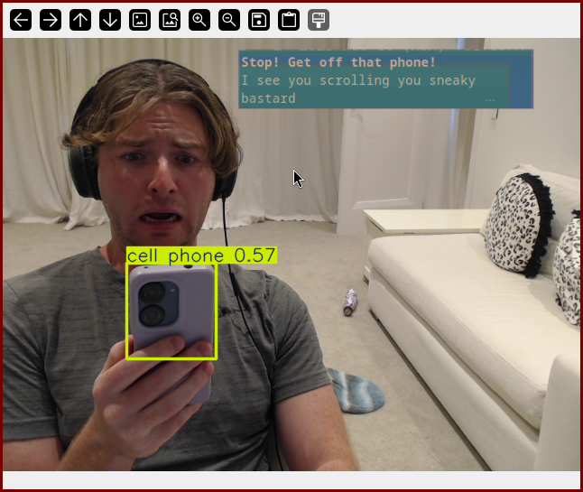

# ScrollCopter

Prevent yourself from using your phone with ScrollCopter 🚁. With the power of
[YOLO](https://docs.ultralytics.com/) and [OpenCV](https://opencv.org/) this
project will ping you to STOP! if it finds you fiending for a scroll...



# Getting Started

1. [Download Python](https://www.python.org/downloads/)
2. Clone the repository

```sh
git clone https://github.com/brandonp2412/ScrollCopter scroll_copter
```

3. Setup a [virtual environment](https://docs.python.org/3/library/venv.html):

```sh
cd scroll_copter
python -m venv .venv
```

4. Activate & Install dependencies

```sh
source .venv/bin/activate
pip install -r requirements.txt
```

5. Run the app!

```sh
python app.py
```
